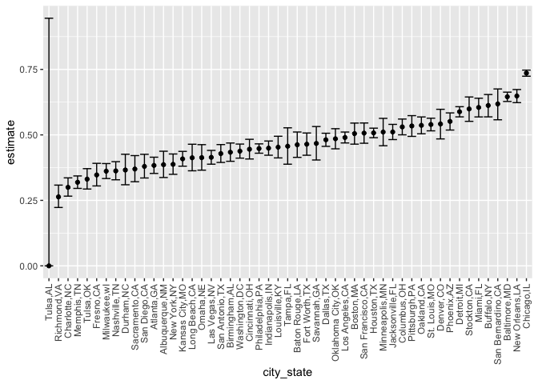

HW5
================
Shirley Liang
2022-11-13

### Problem 1

``` r
allnames = tibble(files = list.files("./data"))

paths = allnames %>% 
  tibble(path = list.files("./data"), ) %>% 
  mutate(
    path = str_c("data/", path),
    data = map(path, read_csv))
```

    ## Rows: 1 Columns: 8
    ## ── Column specification ────────────────────────────────────────────────────────
    ## Delimiter: ","
    ## dbl (8): week_1, week_2, week_3, week_4, week_5, week_6, week_7, week_8
    ## 
    ## ℹ Use `spec()` to retrieve the full column specification for this data.
    ## ℹ Specify the column types or set `show_col_types = FALSE` to quiet this message.
    ## Rows: 1 Columns: 8
    ## ── Column specification ────────────────────────────────────────────────────────
    ## Delimiter: ","
    ## dbl (8): week_1, week_2, week_3, week_4, week_5, week_6, week_7, week_8
    ## 
    ## ℹ Use `spec()` to retrieve the full column specification for this data.
    ## ℹ Specify the column types or set `show_col_types = FALSE` to quiet this message.
    ## Rows: 1 Columns: 8
    ## ── Column specification ────────────────────────────────────────────────────────
    ## Delimiter: ","
    ## dbl (8): week_1, week_2, week_3, week_4, week_5, week_6, week_7, week_8
    ## 
    ## ℹ Use `spec()` to retrieve the full column specification for this data.
    ## ℹ Specify the column types or set `show_col_types = FALSE` to quiet this message.
    ## Rows: 1 Columns: 8
    ## ── Column specification ────────────────────────────────────────────────────────
    ## Delimiter: ","
    ## dbl (8): week_1, week_2, week_3, week_4, week_5, week_6, week_7, week_8
    ## 
    ## ℹ Use `spec()` to retrieve the full column specification for this data.
    ## ℹ Specify the column types or set `show_col_types = FALSE` to quiet this message.
    ## Rows: 1 Columns: 8
    ## ── Column specification ────────────────────────────────────────────────────────
    ## Delimiter: ","
    ## dbl (8): week_1, week_2, week_3, week_4, week_5, week_6, week_7, week_8
    ## 
    ## ℹ Use `spec()` to retrieve the full column specification for this data.
    ## ℹ Specify the column types or set `show_col_types = FALSE` to quiet this message.
    ## Rows: 1 Columns: 8
    ## ── Column specification ────────────────────────────────────────────────────────
    ## Delimiter: ","
    ## dbl (8): week_1, week_2, week_3, week_4, week_5, week_6, week_7, week_8
    ## 
    ## ℹ Use `spec()` to retrieve the full column specification for this data.
    ## ℹ Specify the column types or set `show_col_types = FALSE` to quiet this message.
    ## Rows: 1 Columns: 8
    ## ── Column specification ────────────────────────────────────────────────────────
    ## Delimiter: ","
    ## dbl (8): week_1, week_2, week_3, week_4, week_5, week_6, week_7, week_8
    ## 
    ## ℹ Use `spec()` to retrieve the full column specification for this data.
    ## ℹ Specify the column types or set `show_col_types = FALSE` to quiet this message.
    ## Rows: 1 Columns: 8
    ## ── Column specification ────────────────────────────────────────────────────────
    ## Delimiter: ","
    ## dbl (8): week_1, week_2, week_3, week_4, week_5, week_6, week_7, week_8
    ## 
    ## ℹ Use `spec()` to retrieve the full column specification for this data.
    ## ℹ Specify the column types or set `show_col_types = FALSE` to quiet this message.
    ## Rows: 1 Columns: 8
    ## ── Column specification ────────────────────────────────────────────────────────
    ## Delimiter: ","
    ## dbl (8): week_1, week_2, week_3, week_4, week_5, week_6, week_7, week_8
    ## 
    ## ℹ Use `spec()` to retrieve the full column specification for this data.
    ## ℹ Specify the column types or set `show_col_types = FALSE` to quiet this message.
    ## Rows: 1 Columns: 8
    ## ── Column specification ────────────────────────────────────────────────────────
    ## Delimiter: ","
    ## dbl (8): week_1, week_2, week_3, week_4, week_5, week_6, week_7, week_8
    ## 
    ## ℹ Use `spec()` to retrieve the full column specification for this data.
    ## ℹ Specify the column types or set `show_col_types = FALSE` to quiet this message.
    ## Rows: 1 Columns: 8
    ## ── Column specification ────────────────────────────────────────────────────────
    ## Delimiter: ","
    ## dbl (8): week_1, week_2, week_3, week_4, week_5, week_6, week_7, week_8
    ## 
    ## ℹ Use `spec()` to retrieve the full column specification for this data.
    ## ℹ Specify the column types or set `show_col_types = FALSE` to quiet this message.
    ## Rows: 1 Columns: 8
    ## ── Column specification ────────────────────────────────────────────────────────
    ## Delimiter: ","
    ## dbl (8): week_1, week_2, week_3, week_4, week_5, week_6, week_7, week_8
    ## 
    ## ℹ Use `spec()` to retrieve the full column specification for this data.
    ## ℹ Specify the column types or set `show_col_types = FALSE` to quiet this message.
    ## Rows: 1 Columns: 8
    ## ── Column specification ────────────────────────────────────────────────────────
    ## Delimiter: ","
    ## dbl (8): week_1, week_2, week_3, week_4, week_5, week_6, week_7, week_8
    ## 
    ## ℹ Use `spec()` to retrieve the full column specification for this data.
    ## ℹ Specify the column types or set `show_col_types = FALSE` to quiet this message.
    ## Rows: 1 Columns: 8
    ## ── Column specification ────────────────────────────────────────────────────────
    ## Delimiter: ","
    ## dbl (8): week_1, week_2, week_3, week_4, week_5, week_6, week_7, week_8
    ## 
    ## ℹ Use `spec()` to retrieve the full column specification for this data.
    ## ℹ Specify the column types or set `show_col_types = FALSE` to quiet this message.
    ## Rows: 1 Columns: 8
    ## ── Column specification ────────────────────────────────────────────────────────
    ## Delimiter: ","
    ## dbl (8): week_1, week_2, week_3, week_4, week_5, week_6, week_7, week_8
    ## 
    ## ℹ Use `spec()` to retrieve the full column specification for this data.
    ## ℹ Specify the column types or set `show_col_types = FALSE` to quiet this message.
    ## Rows: 1 Columns: 8
    ## ── Column specification ────────────────────────────────────────────────────────
    ## Delimiter: ","
    ## dbl (8): week_1, week_2, week_3, week_4, week_5, week_6, week_7, week_8
    ## 
    ## ℹ Use `spec()` to retrieve the full column specification for this data.
    ## ℹ Specify the column types or set `show_col_types = FALSE` to quiet this message.
    ## Rows: 1 Columns: 8
    ## ── Column specification ────────────────────────────────────────────────────────
    ## Delimiter: ","
    ## dbl (8): week_1, week_2, week_3, week_4, week_5, week_6, week_7, week_8
    ## 
    ## ℹ Use `spec()` to retrieve the full column specification for this data.
    ## ℹ Specify the column types or set `show_col_types = FALSE` to quiet this message.
    ## Rows: 1 Columns: 8
    ## ── Column specification ────────────────────────────────────────────────────────
    ## Delimiter: ","
    ## dbl (8): week_1, week_2, week_3, week_4, week_5, week_6, week_7, week_8
    ## 
    ## ℹ Use `spec()` to retrieve the full column specification for this data.
    ## ℹ Specify the column types or set `show_col_types = FALSE` to quiet this message.
    ## Rows: 1 Columns: 8
    ## ── Column specification ────────────────────────────────────────────────────────
    ## Delimiter: ","
    ## dbl (8): week_1, week_2, week_3, week_4, week_5, week_6, week_7, week_8
    ## 
    ## ℹ Use `spec()` to retrieve the full column specification for this data.
    ## ℹ Specify the column types or set `show_col_types = FALSE` to quiet this message.
    ## Rows: 1 Columns: 8
    ## ── Column specification ────────────────────────────────────────────────────────
    ## Delimiter: ","
    ## dbl (8): week_1, week_2, week_3, week_4, week_5, week_6, week_7, week_8
    ## 
    ## ℹ Use `spec()` to retrieve the full column specification for this data.
    ## ℹ Specify the column types or set `show_col_types = FALSE` to quiet this message.

``` r
tidy_paths = paths %>%
  separate(files, into = c("arm", "subjectID")) %>% 
  select(arm, subjectID, data) %>% 
  unnest(data) %>% 
  pivot_longer(
    week_1:week_8,
    names_to = "week",
    values_to = "result_data")
```

``` r
tidy_paths %>% 
  mutate(
    arm = recode(
      arm, 
      con = "control",
      exp = "experiment" )
  ) %>% 
  ggplot(aes(x = week, y = result_data, group = subjectID, color = subjectID)) + 
  geom_line() + 
  facet_grid(.~arm) 
```

<!-- -->

#### Looking at the comparision between control and experiment, we see that over all the controls have lower result values in subjects compared to experiment group. In teh control group, it flacuate within a range, whereas the experiment group increase in most subjects.

### Problem 2

``` r
homicides = read_csv("homicide-data.csv")
```

    ## Rows: 52179 Columns: 12
    ## ── Column specification ────────────────────────────────────────────────────────
    ## Delimiter: ","
    ## chr (9): uid, victim_last, victim_first, victim_race, victim_age, victim_sex...
    ## dbl (3): reported_date, lat, lon
    ## 
    ## ℹ Use `spec()` to retrieve the full column specification for this data.
    ## ℹ Specify the column types or set `show_col_types = FALSE` to quiet this message.

#### In the `homicides` dataset, there are 52179 observations and 12 variables, including uid, reported_date, victim_last, victim_first, victim_race, victim_age, victim_sex, city, state, lat, lon, disposition.

``` r
homicides <- homicides %>% 
  janitor::clean_names() %>% 
  mutate(city_state = str_c(city, state, sep = ","),
  disposition_status = case_when(disposition == "Closed without arrest" ~ "unsolved",
                     disposition == "Open/No arrest" ~ "unsolved",
                     disposition == "Closed by arrest" ~ "resolved")) 

summary <- homicides %>% group_by(city_state) %>% 
  summarize(total_number_of_homicides = n(), number_of_unsolved_homicides = sum(disposition_status == "unsolved")) 

summary
```

    ## # A tibble: 51 × 3
    ##    city_state     total_number_of_homicides number_of_unsolved_homicides
    ##    <chr>                              <int>                        <int>
    ##  1 Albuquerque,NM                       378                          146
    ##  2 Atlanta,GA                           973                          373
    ##  3 Baltimore,MD                        2827                         1825
    ##  4 Baton Rouge,LA                       424                          196
    ##  5 Birmingham,AL                        800                          347
    ##  6 Boston,MA                            614                          310
    ##  7 Buffalo,NY                           521                          319
    ##  8 Charlotte,NC                         687                          206
    ##  9 Chicago,IL                          5535                         4073
    ## 10 Cincinnati,OH                        694                          309
    ## # … with 41 more rows

``` r
# Does it make sense to prop.test one city?
Baltimore_MD_proptest <- prop.test(summary %>% filter(city_state == "Baltimore,MD") %>% pull(number_of_unsolved_homicides), 
  summary %>% filter(city_state == "Baltimore,MD") %>% pull(total_number_of_homicides)) %>% 
  broom::tidy()

# Save the output of Baltimore,MD prop.test as an R object Baltimore_MD_proptest.

# Do prop.test for all cities
all_cities <- summary %>% mutate(prop_tests = map2(.x = number_of_unsolved_homicides, .y = total_number_of_homicides, ~ prop.test(x = .x, n = .y)),
  tidy_df = map(.x = prop_tests, ~ broom::tidy(.x))) %>% 
  select(-prop_tests) %>% 
  unnest(tidy_df) %>% 
  select(city_state, estimate, conf.low, conf.high)
```

    ## Warning in prop.test(x = .x, n = .y): Chi-squared approximation may be incorrect

``` r
all_cities
```

    ## # A tibble: 51 × 4
    ##    city_state     estimate conf.low conf.high
    ##    <chr>             <dbl>    <dbl>     <dbl>
    ##  1 Albuquerque,NM    0.386    0.337     0.438
    ##  2 Atlanta,GA        0.383    0.353     0.415
    ##  3 Baltimore,MD      0.646    0.628     0.663
    ##  4 Baton Rouge,LA    0.462    0.414     0.511
    ##  5 Birmingham,AL     0.434    0.399     0.469
    ##  6 Boston,MA         0.505    0.465     0.545
    ##  7 Buffalo,NY        0.612    0.569     0.654
    ##  8 Charlotte,NC      0.300    0.266     0.336
    ##  9 Chicago,IL        0.736    0.724     0.747
    ## 10 Cincinnati,OH     0.445    0.408     0.483
    ## # … with 41 more rows

``` r
all_cities_plot = all_cities %>% 
  mutate(city_state = fct_reorder(city_state, estimate)) %>% 
  ggplot(aes(x = city_state, y = estimate)) +
  geom_point() +
  geom_errorbar(aes(ymin = conf.low, ymax = conf.high)) + 
  theme(axis.text.x = element_text(angle = 90, vjust = 0.5, hjust = 1))

all_cities_plot
```

<!-- -->

### Problem 3

``` r
set.seed(123)

sim = function(mu, n = 30, sigma = 5) {
  sim_data <- t.test(x = rnorm(n = n, mean = mu, sd = sigma), conf.int = 0.95)
  sim_data <- sim_data %>% broom::tidy(.x) %>% 
   mutate(set_mu = mu, mu_hat = estimate, p_value= p.value) %>% 
   select(set_mu, mu_hat, p_value)
}


combine_dat <- data.frame(set_mu = c(), mu_hat = c(), p_value = c())

for (j in 0:6) { 
for (i in 1:5000) {
  result_dat <- sim(j)
  combine_dat <- bind_rows(combine_dat,result_dat)
}
}

combine_dat %>% head()
```

    ##   set_mu     mu_hat   p_value
    ## 1      0 -0.2355188 0.7944204
    ## 2      0  0.8916917 0.2516694
    ## 3      0  0.1221020 0.8788492
    ## 4      0 -0.4694447 0.5750370
    ## 5      0 -0.9179020 0.3884876
    ## 6      0  0.7685832 0.3785964

``` r
power <- data.frame(set_mu = 0:6, rejected = rep(NA,7))

for(i in 1:7) {
power[i,2] <- combine_dat %>% filter(p_value < 0.05, set_mu == (i-1)) %>% count() 
power[i,2] = power[i,2]/5000
}

power_plot = power %>% ggplot(aes(x = set_mu, y = rejected)) +
  geom_point(aes(color = set_mu), size = 2) +
  geom_line(alpha = 0.3) +
  labs(x = "True value of μ",
       y = "Power of the test") +
  ggtitle("True value of μ vs. Power of the test")

power_plot
```

<!-- -->

#### We can see form the plot that as the true value of Mu increase, power of the test increases. Therefore as the effect size increases, the power of the test increases.

``` r
estimated_mu <- combine_dat %>% group_by(set_mu) %>% summarise(mean = mean(mu_hat))

rejected_only <- combine_dat %>% filter(p_value < 0.05) %>% group_by(set_mu) %>% summarise(mean = mean(mu_hat))

estimated_mu_plot <- estimated_mu %>% ggplot(aes(x = set_mu, y = mean)) +
  geom_point(aes(color = set_mu), size = 2) +
  geom_line(alpha = 0.3) +
  labs(x = "True value of μ",
       y = "Average estimate of μ̂")+
  ggtitle("True value of μ vs. Average estimate of μ in all simulations")


rejected_only_estimated_mu_plot <- rejected_only %>% ggplot(aes(x = set_mu, y = mean)) +
  geom_point(aes(color = set_mu), size = 2) +
  geom_line(alpha = 0.3) +
  labs(x = "True value of μ",
       y = "Average estimate of μ̂")+
  ggtitle("True value of μ vs. Average estimate of μ in samples for which the null was rejected")
```

``` r
estimated_mu_plot
```

<!-- -->

``` r
rejected_only_estimated_mu_plot
```

<!-- -->

#### The sample average of μ̂ across tests for which the null is rejected do not approximately equal to the true value of μ when μ is below 4. This is because the power of the test increases as effect size increases, there are more proportion of times the null was rejected as μ increases. Thus, sample average of μ̂ across tests for which the null is rejected approximately equal to the true value of μ when μ is greater.
